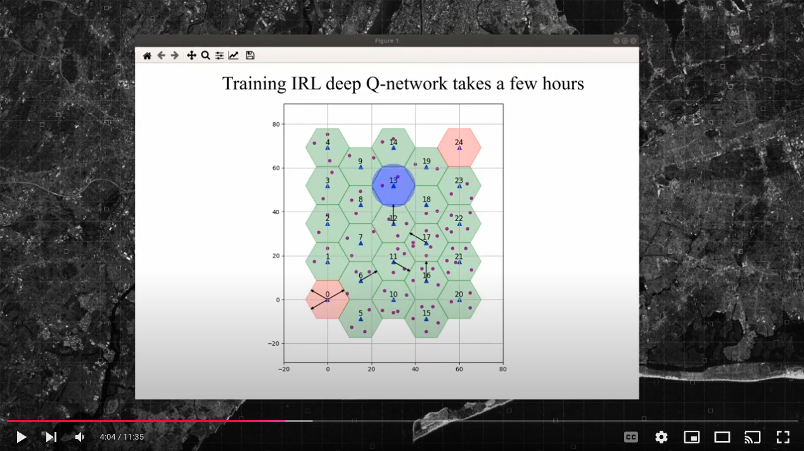

# UAV Communication Using Inverse Reinforcement Learning (IRL) 🚁

This project implements a suite of Reinforcement Learning (RL) and Inverse Reinforcement Learning (IRL) methods for UAV communication, including Behavioral Cloning, Q-learning, Deep RL, and other learning policies. The repository explores various RL algorithms for autonomous navigation and decision-making in UAVs.


## 📄 Paper
You can find the paper for this repository at [Elsevier](https://www.sciencedirect.com/science/article/pii/S1389128624006212) or [Arxiv](https://arxiv.org/pdf/2306.10071).

### Abstract
This paper investigates an interference-aware joint path planning and power allocation mechanism for a cellular-connected unmanned aerial vehicle (UAV) in a sparse suburban environment. The UAV’s goal is to fly from an initial point and reach a destination point by moving along the cells to guarantee the required quality of service (QoS). In particular, the UAV aims to maximize its uplink throughput and minimize interference to the ground user equipment (UEs) connected to neighboring cellular base stations (BSs), considering both the shortest path and limitations on flight resources. Expert knowledge is used to experience the scenario and define the desired behavior for the sake of the agent (i.e., UAV) training. To solve the problem, an apprenticeship learning method is utilized via inverse reinforcement learning (IRL) based on both Q-learning and deep reinforcement learning (DRL). The performance of this method is compared to learning from a demonstration technique called behavioral cloning (BC) using a supervised learning approach. Simulation and numerical results show that the proposed approach can achieve expert-level performance. We also demonstrate that, unlike the BC technique, the performance of our proposed approach does not degrade in unseen situations.

### 🎥 Demo
The video below shows a short demo of the different algorithms we tried for the paper. It also shows the simulation environment that was designed for this project.
[](https://youtu.be/FGAlHaTQ_nc?si=yr4_1zYdxwuacskm "Sample video")

## 📑 Table of Contents
- Requirements
- Installation
- Project Structure
- Configuration
- Usage
- Cite
- License

## 📦 Requirements

- Python 3.6 or later
- Libraries specified in `requirements.txt`

To install the required libraries, use the following command:

    pip install -r requirements.txt

## 🚀 Installation

To get started, clone this repository:

    git clone https://github.com/YourUsername/Inverse-RL-Apprenticeship-learning-UAV-Communication.git
    cd Inverse-RL-Apprenticeship-learning-UAV-Communication

## 📂 Project Structure

- `main.py`: The primary script for running the IRL-based UAV communication project.
- `config.py`: Configuration file that includes global settings and parameters for different modes (e.g., `IRL_SGD`, `IRL_DQN`, `DRL`, `QRL`, etc.).
- `behavioral.py`: Implements imitation learning through behavioral cloning.
- `deeprl.py`: Defines functions for Deep Reinforcement Learning.
- `expert.py`: Contains expert operation functions.
- `inverserlDQN.py`: Implements Inverse Reinforcement Learning using a Deep Q-Network.
- `location.py`: Handles location and allocation functions.
- `qlearning.py`: Basic Q-learning reinforcement learning script.
- `randompolicy.py`: Implements a random policy.
- `shortestpath.py`: Uses the shortest path approach, such as Dijkstra's algorithm.

## ⚙️ Configuration

The `config.py` file contains several parameters and settings that you can modify to control different aspects of the project. Key configuration options include:

- **Mode**: Specifies the operation mode. Possible values include:
  - `Expert`
  - `IRL_SGD`
  - `IRL_DQN`
  - `DRL` (Deep Reinforcement Learning)
  - `QRL` (Q-learning Reinforcement Learning)
  - `BC` (Behavioral Cloning)
  - `Shortest` (Shortest Path)
  - `Random` (Random Policy)
  - `ResultsIRL` (Show IRL results)
  - `EvaluationTraining` (Evaluate model training)
  - `EvaluationScenario` (Evaluate scenario results)
  - `EvaluationError` (Evaluate model errors)

  Example setting: `Mode = 'IRL_SGD'`

- **Config_Flags**: A dictionary containing flags for various settings:
  - `SAVE_path`: Set to `True` to save paths generated during runs
  - `Display`: Set to `True` to display graphs and logs for real-time monitoring

- **Config_General**: General settings, such as default learning rate and discount factor. These may vary depending on the mode you choose.

- **Config_Path**: Controls parameters specific to pathfinding methods, which may include settings like maximum path length or heuristic functions if applicable.

- **Config_Power**: Parameters related to power management for UAV communication. This can include transmit power levels, power thresholds, and other UAV-specific settings.

## 📝 Usage

### Running the Main Script

The main script, `main.py`, controls the execution of the entire project. To run it, execute the following command in your terminal:

    python main.py

### Running Individual Modules

Each Python file represents a distinct part of the project. Here are some examples of running individual modules:

1. **Behavioral Cloning**: To execute the behavioral cloning functions, run
       python behavioral.py

2. **Deep Q-Network (Inverse RL)**: Run the DQN-based IRL approach by executing
       python inverserlDQN.py

3. **Q-Learning**: To run Q-learning standalone, use
       python qlearning.py

4. **Shortest Path**: Execute shortest path functions with
       python shortestpath.py

5. **Random Policy**: Run the random policy module using
       python randompolicy.py

Make sure to configure the desired mode and parameters in `config.py` before running these scripts.

## 🔖 Citation

If you find this work useful, please cite our paper as follows:
<br />
```
@article{shamsoshoara2024joint,
  title={Joint path planning and power allocation of a cellular-connected uav using apprenticeship learning via deep inverse reinforcement learning},
  author={Shamsoshoara, Alireza and Lotfi, Fatemeh and Mousavi, Sajad and Afghah, Fatemeh and G{\"u}ven{\c{c}}, {\.I}smail},
  journal={Computer Networks},
  volume={254},
  pages={110789},
  year={2024},
  publisher={Elsevier}
}
```

## 📜 License

This project is licensed under the MIT License.
